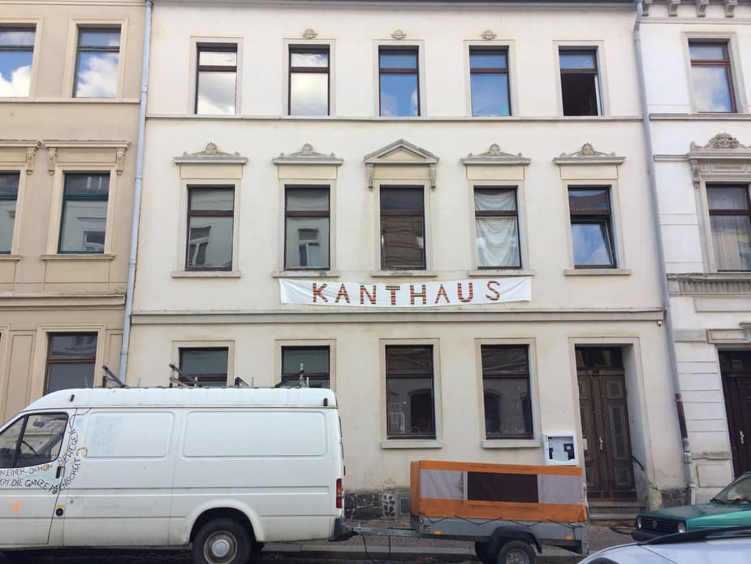
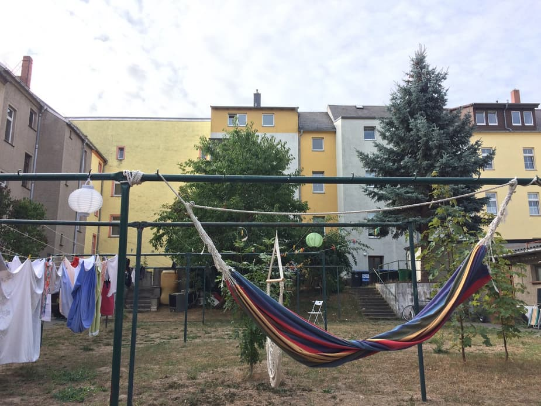

Im Spätsommer 2018 war James zu Besuch im Kanthaus und hat seine Beobachtungen und Eindrücke wie folgt dokumentiert:

_“There was lots of cheese, yogurt and sausage, but the packages were sliced open, so we can’t take it. It’s not the usual thing, but this is what supermarkets do sometimes when they realise that people are bin-diving.”_

===

Hidden in the nook of a cobbled street in Wurzen, and just a few stops on the S-Bahn outside of  Leipzig, is Kanthaus. At the entrance, a billowing colourful banner welcomes  weary travellers and fellow foodsavers.

Kanthaus is the [new European headquarters for foodsharing](/blog/2018-09-26_foodsharing). A dedicated space for the development of the European food sharing movement, the community here is committed to developing the tools and structures to help make that happen.

Kanthausians live in a dedicated sharing community. When you walk through the door, a member of the community helps you navigate the two buildings with its numerous rooms dedicated to computer work, meetings, crafts, food storage and preparation, recreation, and dorms.

Just over a year old, the space is home to a range of projects including the new online foodsaving platform, [Karrot](https://karrot.world). On any given day there are more than ten people living in the house, volunteering, or passing through - as I was. At its busiest, there are more than twenty-six residents living communally, dividing the various chores and - of course - food liberation missions. It becomes increasingly clear as one goes along, that everything in this space, even the toothbrushes, is shared.

Kanthaus focuses on constantly iterating over both sustainable projects and the space itself. It was collectively purchased last year by members of [yunity](https://yunity.org), a sharing network made up of nomadic individuals, of which Kanthaus and Karrot are sub-projects. In 2017 the two neighbouring houses K20 and K22 Kantstraße were empty shells. Fourteen months and an enormous amount of work later, the team and dozens of volunteers have transformed the space. They’ve fully re-wired both buildings, [experimented with a washing machine water reclamation system](/blog/2018-09-05_experiments-in-water-recycling), re-plumbed one of the buildings, set up water heating via solar array and are currently working on the chimneys to provide better airflow. You get the impression people here spend as much time working with their hands as they do on various coding projects.

It doesn’t take long to feel at home here, even as a visitor. I’ve gone out of my way over the last six months to spend time with a few different communities, to understand different ways of living, uses of time, reasons why people come together and means of governance. Like nearby Leipzig, Kanthaus is full of energy. It takes a relatively minimalistic approach to managing the community despite the level of activity going on, with weekly coordination and occasional evaluation meetings being the only required group gatherings. A typical meeting at Kanthaus is more akin to a group of friends having a discussion than an uncomfortable rigid silence as is quite common in some communities, and whilst there is some formality the intention is more to stay on topic and prevent five-minute tangents into whether or not to bin-dive for rare printer paper or just to go and buy it.

Sharing resources is central to the community at Kanthaus and the most obvious example of this is in the sharing of food, whether bin-dived, saved from stores or grown in the garden. Every once a week, a group of Kanthausians will venture to a nearby supermarket bin to restock, this might mean taking the cargo-bike or S-Bahn to go some kilometers to the good spots. Once collected, the food is washed in a purpose-made food prep room consisting of an old bathtub raised on a breeze block, and then distributed throughout the house in one of the six storage rooms and areas. Members and volunteers of the house eat lunch and dinner communally every day. With more than enough food to go around, the house opens its doors for [Fairteiler](/events/fairteiler) (food sharing) once a week for the community to take their pick, although this is currently more a side-project whilst they try to work out how to make such community outreach efforts more sustainable and less time-intensive, given that their energies are focused on facilitating this at scale through tools like Karrot.

Karrot, currently being developed by Kanthausianer Tilmann Becker, is an [open source software](https://github.com/yunity/karrot-frontend/) focused on making it easier for food-saving communities to organise their pickups and distribution of food. They’re hoping this tool amongst others and the ongoing development of this community will begin to make a dent in the shockingly high 88 million tonnes of food wasted across the EU each year - that’s over 137kg per person here in Germany alone. Making that change cannot work online alone though, and traveling to foodsharing communities and Karrot user groups outside of Germany is also an integral part of building this transnational movement of grassroots foodsaving activists. In doing this, they come closer to their nomadic roots in yunity again – the big difference being that now they have Kanthaus to come home to.
